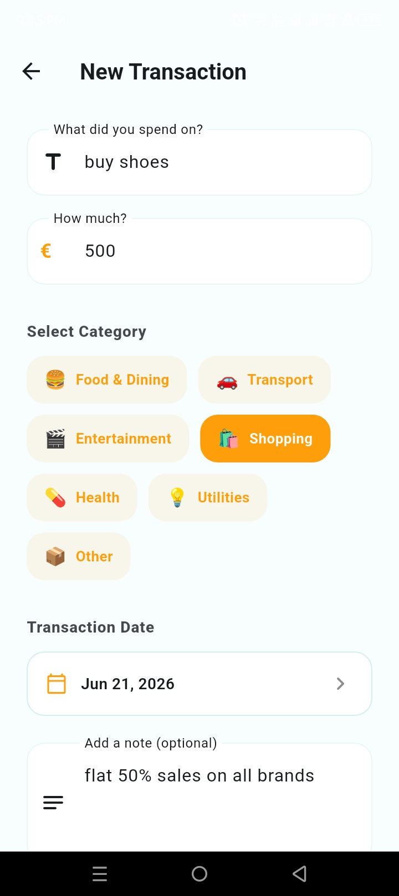
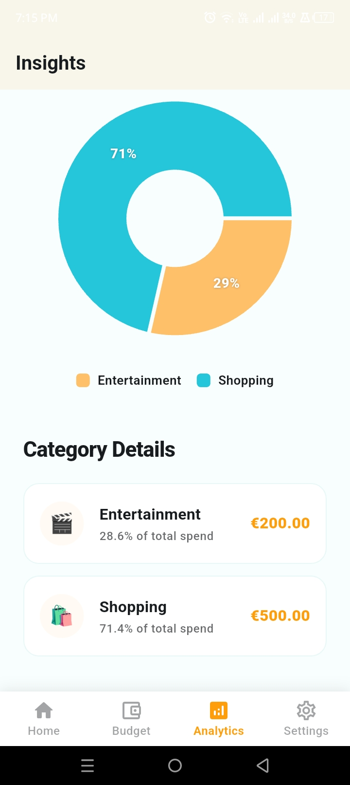
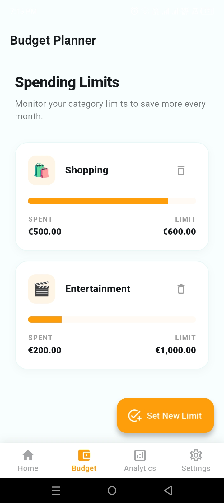
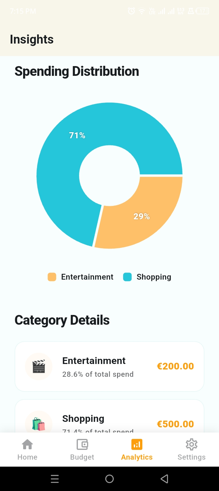
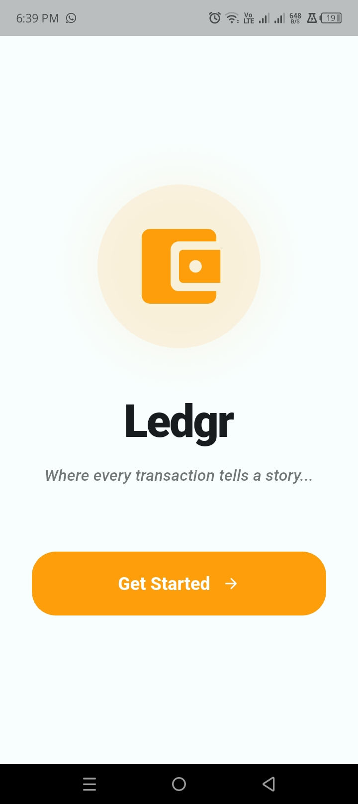
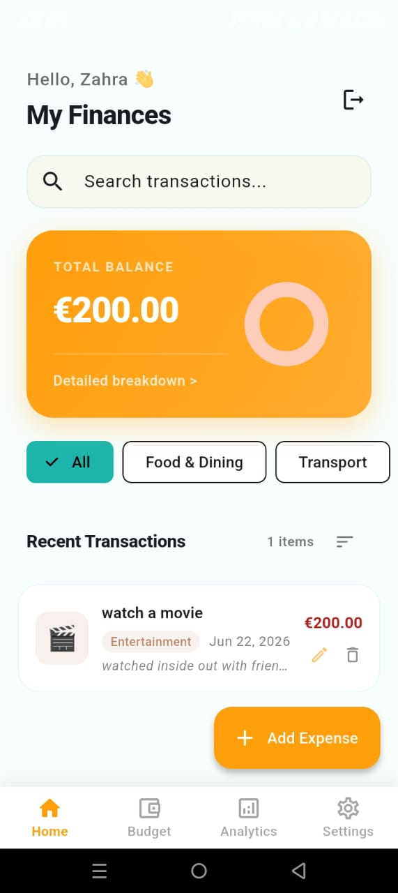
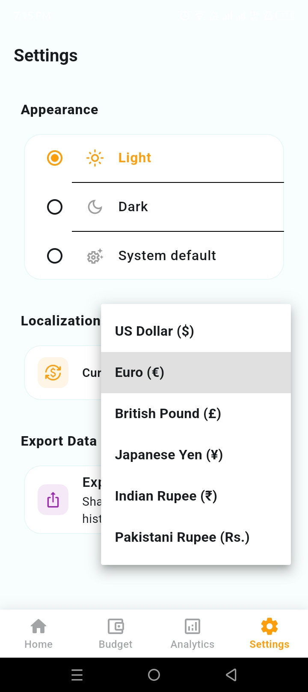

<div align="center">

# 💰 Ledgr

### A production-ready personal finance tracker built with Flutter & Firebase

[](https://flutter.dev)
[](https://dart.dev)
[](https://firebase.google.com)
[](https://riverpod.dev)
[](LICENSE)
[](CONTRIBUTING.md)

<br/>

> Track. Analyse. Budget. — All in one beautifully designed app.

<br/>

<!--
  ┌──────────────────────────────────────────────────────────┐
  │  SCREENSHOTS — replace these placeholders with real PNGs │
  │  Recommended: 3-4 screenshots, 390×844px (iPhone 14 size)│
  └──────────────────────────────────────────────────────────┘
-->

| Home Dashboard | Analytics | Budgets | Settings |
|:-:|:-:|:-:|:-:|
|  |  |  |  | | Intro | Add Expense | Budget Planner | Settings |
|:-:|:-:|:-:|:-:|
|  |  |  |  |

</div>

---

## ✨ Features

| Feature | Description |
|---|---|
| 🔐 **Auth** | Email/password sign-up and one-tap Google Sign-In, powered by Firebase Auth |
| 💸 **Expense Tracking** | Add, edit and delete expenses with category tags, notes, and dates |
| 📊 **Visual Analytics** | Pie & bar charts (fl_chart) showing spending by category and over time |
| 📁 **Budget Management** | Set monthly budgets per category with real-time progress tracking |
| 💱 **Multi-Currency** | Switch between USD, EUR, GBP, JPY, INR, PKR — persisted across sessions |
| 📤 **CSV Export** | Export your expenses to CSV for use in Excel/Google Sheets |
| 🔔 **Notifications** | Local push notifications via `flutter_local_notifications` |
| 🌙 **Dark Mode** | Full light/dark theme with user preference saved locally |
| ☁️ **Real-time Sync** | Firestore live streams keep data in sync across devices instantly |

---

## 🏛️ Architecture

Ledgr follows **Clean Architecture** with a strict separation of concerns across three layers:

```
lib/
├── core/                    # App-wide utilities & setup
│   ├── constants/           # App-level constants
│   ├── di/                  # Riverpod providers (dependency injection)
│   ├── errors/              # Typed failure classes
│   ├── theme/               # Light & dark MaterialTheme + ThemeNotifier
│   └── utils/               # Currency & date helpers
│
├── domain/                  # Pure business logic — zero Flutter imports
│   ├── entities/            # Expense, Budget, User entities (Equatable)
│   ├── repositories/        # Abstract repository contracts
│   └── usecases/            # One class per use-case (SRP)
│
├── data/                    # Infrastructure — Firebase implementation
│   ├── models/              # Firestore serialisation (fromFirestore/toFirestore)
│   ├── repositories/        # Concrete repo implementations
│   └── services/            # FirebaseAuthService, FirestoreService, ExportService
│
└── presentation/            # Flutter UI layer
    ├── controllers/         # Riverpod StateNotifiers (AuthController, ExpenseController…)
    ├── pages/               # Feature-based screen folders
    │   ├── auth/            # Login, Signup
    │   ├── home/            # Dashboard
    │   ├── analytics/       # Insights & charts
    │   ├── budgets/         # Budget management
    │   └── settings/        # Currency, theme, export, account
    └── widgets/             # Shared/reusable widgets
```

### Data Flow

```
UI (Page) → Controller (StateNotifier) → UseCase → Repository (abstract)
                                                        ↓
                                             RepositoryImpl → Firebase Service
```

State management is handled entirely with **Riverpod 2** — no `setState`, no `BuildContext` passed down. Every provider is declared in `core/di/providers.dart` as the single source of truth.

---

## 🛠️ Tech Stack

| Layer | Technology |
|---|---|
| UI Framework | Flutter 3 |
| Language | Dart 3 |
| State Management | flutter_riverpod 2 |
| Backend / Auth | Firebase Auth + Cloud Firestore |
| Charts | fl_chart |
| Notifications | flutter_local_notifications |
| Data Export | csv + share_plus |
| Local Storage | shared_preferences |
| DI Pattern | Riverpod Providers |
| Code Quality | flutter_lints + analysis_options.yaml |

---

## 🚀 Getting Started

### Prerequisites

- [Flutter SDK](https://docs.flutter.dev/get-started/install) `>=3.0.0`
- [Dart SDK](https://dart.dev/get-dart) `>=3.0.0`
- A [Firebase project](https://console.firebase.google.com/) with **Authentication** and **Firestore** enabled
- [FlutterFire CLI](https://firebase.flutter.dev/docs/cli/) installed globally

### 1. Clone the repository

```bash
git clone https://github.com/YOUR_USERNAME/ledgr.git
cd ledgr
```

### 2. Connect Firebase

```bash
# Install the FlutterFire CLI (once)
dart pub global activate flutterfire_cli

# Configure — this creates lib/firebase_options.dart automatically
flutterfire configure
```

> In the Firebase Console, enable **Email/Password** and **Google** sign-in providers, and create a **Cloud Firestore** database (start in test mode for development).

### 3. Install dependencies

```bash
flutter pub get
```

### 4. Run the app

```bash
# Android / iOS / Chrome
flutter run

# Specific platform
flutter run -d chrome
flutter run -d android
flutter run -d ios
```

### 5. (Optional) Run tests

```bash
flutter test
```

---

## 🔒 Firebase Security Rules

For production, replace the default Firestore rules with the following to ensure users can only access their own data:

```js
rules_version = '2';
service cloud.firestore {
  match /databases/{database}/documents {
    match /users/{userId}/{document=**} {
      allow read, write: if request.auth != null && request.auth.uid == userId;
    }
  }
}
```

---

## 🗺️ Roadmap

- [ ] Recurring expense scheduling
- [ ] Receipt photo capture (Firebase Storage)
- [ ] Multiple account support (cash, bank, card)
- [ ] Budget alerts via push notifications
- [ ] iOS & Android app store releases
- [ ] Web PWA deployment

---

## 🤝 Contributing

Contributions are what make open source great. Any contributions you make are **greatly appreciated**.

1. Fork the project
2. Create your feature branch: `git checkout -b feature/amazing-feature`
3. Commit your changes: `git commit -m 'feat: add amazing feature'`
4. Push to the branch: `git push origin feature/amazing-feature`
5. Open a Pull Request

Please follow the existing code style — all new code must pass `flutter analyze` with zero warnings.

---

## 📄 License

Distributed under the MIT License. See [`LICENSE`](LICENSE) for more information.

---

## 👤 Author

**Your Name**
- GitHub: [@YOUR_USERNAME](https://github.com/zahra01-m)
- LinkedIn: [your-linkedin](https://linkedin.com/in/zahra-mushtaq-)

---

<div align="center">

If you found this project helpful, consider giving it a ⭐ — it means a lot!

</div>
